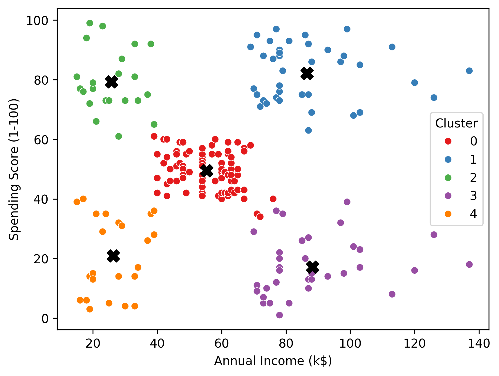
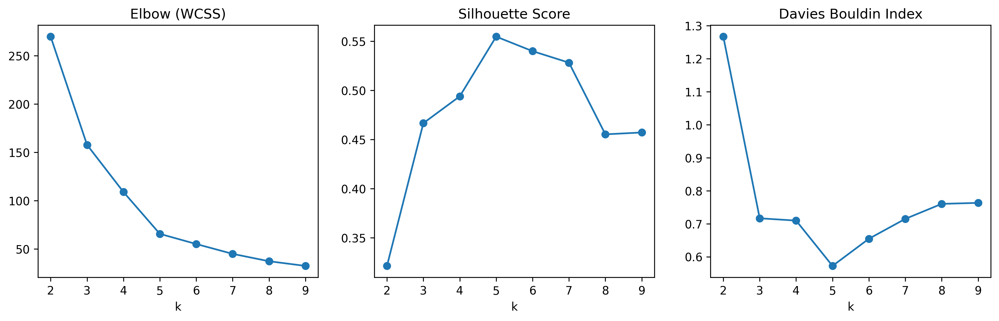

# <Mall Customers Segmentation>

## 📌 Overview
This project applies clustering analysis to segment customers based on purchasing behavior and income level. The goal is to identify distinct customer groups and provide actionable marketing insights.
---

## Business Problem
Retail businesses often treat customers as a single group, leading to inefficient marketing strategies. Understanding customer segments enables targeted campaigns, improved retention, and better resource allocation.
---

## Objective
- Identify distinct customer segments
- Profile each segment
- Derive business insights
---

## Dataset
- Source: Mall Customers Dataset (Kaggle)
- Rows: 200 customers
- Features:
  - Gender
  - Age
  - Annual Income (k$)
  - Spending Score (1–100)
---

## Methodology
### 1. Data Preparation
- Checked missing values
- Selected relevant features
- Standardized variables

### 2. Exploratory Data Analysis
- Initial scatter visualization

### 3. Clustering
- Algorithm: K-Means
- Optimal clusters: 5
- Evaluation: Elbow, Silhouette, Davies-Bouldin

### 4. Cluster Profiling
Segments analyzed by:
- Income
- Spending
- Age
- Gender distribution
---

## 📈 Results & Visualizations

### Cluster Distribution

### Elbow Method

### Age by Cluster

---

## 👥 Customer Segments

### Segment 0 — Mainstream Customers
- Moderate income
- Moderate spending
- Average age  
👉 Represents the general customer base

### Segment 1 — Affluent Enthusiasts
- High income
- High spending  
👉 Highest-value customers

### Segment 2 — Impulsive Spenders
- Low income
- High spending
- Younger customers  
👉 Promotion-driven buyers

### Segment 3 — Wealthy Conservatives
- High income
- Low spending
- Older customers  
👉 Under-engaged premium segment

### Segment 4 — Budget Customers
- Low income
- Low spending
- Younger customers  
👉 Price-sensitive segment
---

## 💡 Key Insights
- High-income low-spending customers represent untapped revenue
- High-spending low-income customers may be promotion-dependent
- High-income high-spending segment should be prioritized for retention
- Impulsive buyers are predominantly younger customers, suggesting age-related spending behavior
- 40% of customers are mainstream customers which is in cluster 0 
---

## 🛠 Tools & Technologies
- Python
- Pandas
- Scikit-learn
- Matplotlib
- Seaborn
- Jupyter Notebook
